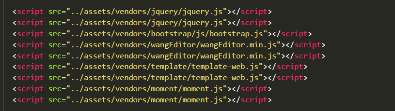

# 前端模块化 (Require.js)


## 为什么要用 前端模块化

> 早期，所有Javascript代码都写在一个文件里面，只要加载这一个文件就够了。后来，代 码越来越多，一个文件不够了，必须分成多个文件，依次加载。如下：




```html
　　<script src="1.js"></script>
　　<script src="2.js"></script>
　　<script src="3.js"></script>
　　<script src="4.js"></script>
　　<script src="5.js"></script>
　　<script src="6.js"></script>
```

>  这段代码依次加载多个js文件。

这样的写法有很大的缺点:

1. 加载的时候，浏览器会停止网页渲染，加载文件越多，网页失去响应的时间就会越长

2. 由于js文件之间存在依赖关系，因此必须严格保证加载顺序（比如上例的1.js要在2.js的前面），依赖性最大的模块一定要放到最后加载，当依赖关系很复杂的时候，代码的编写和维护都会变得困难。

   ​

为了解决这两个问题 ：

1. 实现js文件的异步加载，避免网页失去响应；
2. 管理模块之间的依赖性，便于代码的编写和维护。


## **所以，require.js诞生了**


官网网址：http://requirejs.org/

```javascript
/* ---
RequireJS is a JavaScript file and module loader. It is optimized for in-browser use, but it can be used in other JavaScript environments, like Rhino and Node. Using a modular script loader like RequireJS will improve the speed and quality of your code.
IE 6+ .......... compatible ✔
Firefox 2+ ..... compatible ✔
Safari 3.2+ .... compatible ✔
Chrome 3+ ...... compatible ✔
Opera 10+ ...... compatible ✔
Get started then check out the API.
--- */
```


##  模块化的标准

让模块拥有更好的通用性！

+ AMD : Async Module Definition  异步模块定义 require.js

>  依赖前置： 在一开始就将所有的依赖项全部加载

+ CMD : Common Module Definition  通用模块定义 sea.js

> 依赖延迟： 在需要的时候才去加载依赖项


## 模块化的实现（require.js）
下载后，把它放在目录下面，就可以加载了
```html
　<script src="js/require.js"></script>
```

###  定义模块
+ 在require.js中，每个模块也是分成单独的文件保存的

+ 每一个模块中都有自己单独的作用域！

+ 在定义模块的时候，需要使用requirejs提供的函数`define()` 进行定义

  语法：

      define("模块名称", ["模块的依赖项"], function(){
         模块中所有的代码全都放到这个函数中
      })
### 引用模块

+ 在require.js中，引用一个模块使用require.js提供的函数 `require()`

      语法： require(["模块文件的路径(不带.js后缀的)"], function(){
          //模块加载成功之后的回调函数
          //模块的加载是异步的，在模块加载完成之后，才能使用模块的相关功能
      })


### 模块的注意项

**定义模块的时候，有导出项的情况**
+ 如果有导出项，只需要把导出项通过return语句进行返回即可！

**引用模块时，模块有导出项，怎么使用导出项**
+ 要接收模块的返回值，那么就在回调函数中的形参里声明形参来接收
+ requiresjs 会自动为形参赋值
+ 引入多个模块时，形参的顺序和模块加载的顺序是一一对应的！！！
```javascript         
       require(['./modules/a', "./modules/b", "./modules/c"], function(ma, mb, mc){
            console.log(mb);
            console.log(mc);
       })
```

**注意：**在请求多个模块的时候，一般将没有返回值的模块放在后面，有返回值的放在前面，这样就可以避免要为没有返回值的模块写形参！
       require([ "./modules/b", "./modules/c",'./modules/a'], function(mb, mc){
           console.log(mb);
           console.log(mc);
       })

**模块的依赖项**

在定义一个模块的时候，这个模块内部可能会使用到其他模块的内容，这些其他模块就可以称作当前模块的依赖项

```javascript
//5-模块的 依赖项
define(['./c'],function(toolbox){
    console.log('我有依赖项，依赖的是工具箱:');
    console.log(toolbox);
});
```


## ### 模块路径的查找方式

​      在require.js中，模块路径的查找方式, 一共有三种：


1. 不做任何配置，直接以当前文件的路径作为参照

    require(["./modules/a"])

   ​

2. 如果设置了data-main属性，那么模块的查找，会以data-main指定的文件的路径作为基础（几乎不用）

   + data-main是一个属性，是引入require.js的script标签的属性
+ 这个属性可以用来指定一个文件，加载文件的路径会以这路径为基础， 指定的文件会在require.js加载完毕之后，通过异步的方式加载，并且执行里面的代码,

```javascript
  <script src="require.js" data-main="./js/"></script>
```

3.如果通过require.config方法配置了基础路径，那么所有的模块查找都会以这个基础路径作为参照

```javascript
//config方法是用来配置require的一些加载规则的！
  require.config({
    //baseUrl 指的就是查找模块时的基础路径，所有的模块的查找都会以这个为参照
    //baseUrl 一般都被设置为绝对路径
    baseUrl: "/modules",
    //可以用这paths给模块路径设置别名（ID）
    paths: {
      dianzuan: "./gongju/diandong/zuankong/dahaode/dianzuan"
    }
  })
 
//当引用模块的时候，模块的路径  baseUrl + 引用模块的路径
// require(["dianzuan"]);
```

**注意**： 第三种方式中 找文件的规则是：` baseUrl + paths`  


### 第三方插件使用
#### 支持模块化
	用模块化语法引入
#### 不支持模块化
+ 没有依赖项，没有导出项，require直接引入

+ 有依赖项，没有导出项
  + shim属性中进行配置

+ 有依赖项且有导出项
  + shim属性中进行配置
```javascript
     require.config({
            baseUrl: "/modules",
            paths: {
                xyz: "./buzhichiamddeyouyilaixiangdemokuai",
                jquery: "../jquery.min",
                abc: "./buzhichiamddeyoudaochuxiangdemokuai",
                
            },
            //require.js中可通过设置shim，让不支持模块化的第三方内容
            //和require.js能够实现更好的配合
            shim: {
                //配置xyz
                xyz: {
                    //设置依赖项： jquery
                    deps: ["jquery"]
                },
                //配置abc
                abc: {
                    deps: ["jquery"],
                    exports: "animate" //导出项名称
                }
            }
        })
```
